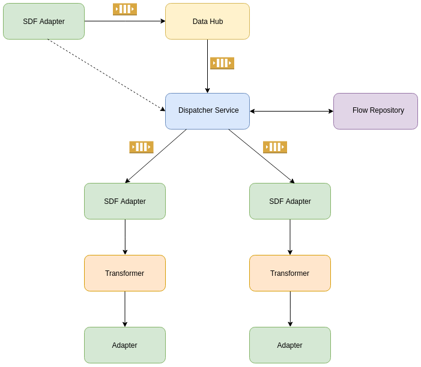

<p align="center">
  
</p>

The revolution in data synchronization — the Open Integration Hub enables simple data synchronization between any software applications and thus accelerates digitalisation

Visit the official [Open Integration Hub homepage](https://www.openintegrationhub.org/)

# Dispatcher Service

The OIH Dispatcher Service can be used to transfer data from one flow to another. This allows for automated propagation of data among any number of connected applications and serves as the basis for the OIH Hub and Spoke functionality.

## Technical description

The Dispatcher service consists of two main parts: A user-facing API that allows for the creation and modification of tenant-specific hub-and-spoke configurations, and an automated component that propagates data based on these configurations.

### Configuration

A configuration describes a list of applications, each with an arbitrary number of outbound (app-to-OIH) and inbound (OIH-to-app) flows. Each flow may use its own schema, operation, or connector actions. For example:

```json
[
  {
    "applicationName": "SnazzyContacts",
    "applicationUid": "snazzy",
    "adapterComponentId": "5ce27d453860ff001a034274",
    "transformerComponentId": "5ce27f4b3860ff001a034277",
    "outbound": {
      "active": true,
      "flows": [
        {
          "adapterAction": "getPersonsPolling",
          "transformerAction": "transformPersonToOih",
          "schemaUri": "http://metadata.openintegrationhub.com/api/v1/domains/5d9b2511d48c29001a202169/schemas/person"
        }
      ]
    },
    "inbound": {
      "active": true,
      "flows": [
        {
          "adapterAction": "upsertPerson",
          "transformerAction": "transformPersonFromOih",
          "schemaUri": "http://metadata.openintegrationhub.com/api/v1/domains/5d9b2511d48c29001a202169/schemas/person",
          "operation": "CREATE"
        },
        {
          "adapterAction": "upsertPerson",
          "transformerAction": "transformPersonFromOih",
          "schemaUri": "http://metadata.openintegrationhub.com/api/v1/domains/5d9b2511d48c29001a202169/schemas/person",
          "operation": "UPDATE"
        }
      ]
    }
  },
  {
    "applicationName": "Wice CRM",
    "applicationUid": "wice",
    "adapterComponentId": "5ce27d653860ff001a034275",
    "transformerComponentId": "5ce27f2d3860ff001a034276",
    "outbound": {
      "active": true,
      "flows": [
        {
          "adapterAction": "getPersonsPolling",
          "transformerAction": "transformPersonToOih",
          "schemaUri": "http://metadata.openintegrationhub.com/api/v1/domains/5d9b2511d48c29001a202169/schemas/person"
        }
      ]
    },
    "inbound": {
      "active": true,
      "flows": [
        {
          "adapterAction": "upsertPerson",
          "transformerAction": "transformPersonFromOih",
          "schemaUri": "http://metadata.openintegrationhub.com/api/v1/domains/5d9b2511d48c29001a202169/schemas/person",
          "operation": "CREATE"
        },
        {
          "adapterAction": "upsertPerson",
          "transformerAction": "transformPersonFromOih",
          "schemaUri": "http://metadata.openintegrationhub.com/api/v1/domains/5d9b2511d48c29001a202169/schemas/person",
          "operation": "UPDATE"
        }
      ]
    }
  },
  {
    "applicationName": "MS Outlook",
    "applicationUid": "outlook",
    "adapterComponentId": "5ce27d653860ff001a034642",
    "transformerComponentId": "5ce27f2d3860ff001a036290",
    "outbound": {
      "active": false,
      "flows": []
    },
    "inbound": {
      "active": true,
      "flows": [
        {
          "adapterAction": "createContact",
          "transformerAction": "transformPersonFromOih",
          "schemaUri": "http://metadata.openintegrationhub.com/api/v1/domains/5d9b2511d48c29001a202169/schemas/person",
          "operation": "CREATE"
        },
        {
          "adapterAction": "updateContact",
          "transformerAction": "transformPersonFromOih",
          "schemaUri": "http://metadata.openintegrationhub.com/api/v1/domains/5d9b2511d48c29001a202169/schemas/person",
          "operation": "UPDATE"
        }
      ]
    }
  }
]
```

In this example, any changes made in Wice are propagated to Snazzy and Outlook, and changes made in Snazzy are propagated to Wice and Outlook. Changes made in Outlook are not propagated, as it does not have an active outbound flow. In this configuration, only _Create_ and _Update_ operations are supported, whereas _Delete_ operations are discarded.

The dispatcher will automatically create a flow for each entry in the `flows` arrays at the Flow Repository, and save their ids as part of the configuration. When a configuration is deleted, all associated flows are automatically deleted alongside it.

### Propagation

The Dispatcher Service listens for data update events published by the Data Hub. Whenever such an event is received, it checks whether the associated tenant has a configuration listing the source and domain of the change as a source.

If this is the case, the Dispatcher Service then iterates through all listed active targets for this source/domain. The Flow Repository is checked to ascertain whether the flows exist and are currently active. Any inactive flows are (re-)started by the Dispatcher Service. Then the update data is propagated to each of the flows' SDF adapters.



## Local installation/development

You can start the Dispatcher Service locally using `npm start`, which requires an active MongoDB and RabbitMQ running on localhost. The API can then be reached under `http://localhost:3013`, with the Swagger API-Documentation reachable under the path `http://localhost:3013/api-docs`

In the `examples` folder you can find a simple node script that creates a basic configuration and spawns an event that should be received by a local instance of the Dispatcher Service.

## REST-API documentation

Visit `dispatcher-service.openintegrationhub.com/api-docs/` to view the Swagger API-Documentation

## Current status

Dispatcher service is currently capable of:

- Storing and retrieving dispatch configurations
- Routing incoming dispatch events according to these configurations
- Communicating with the Flow Repository to automatically create necessary flows for a configuration
- Communicating with the Flow Repository to check the flows statuses, and start them if necessary
- Communicating with the Flow Repository to automatically delete associated flows
